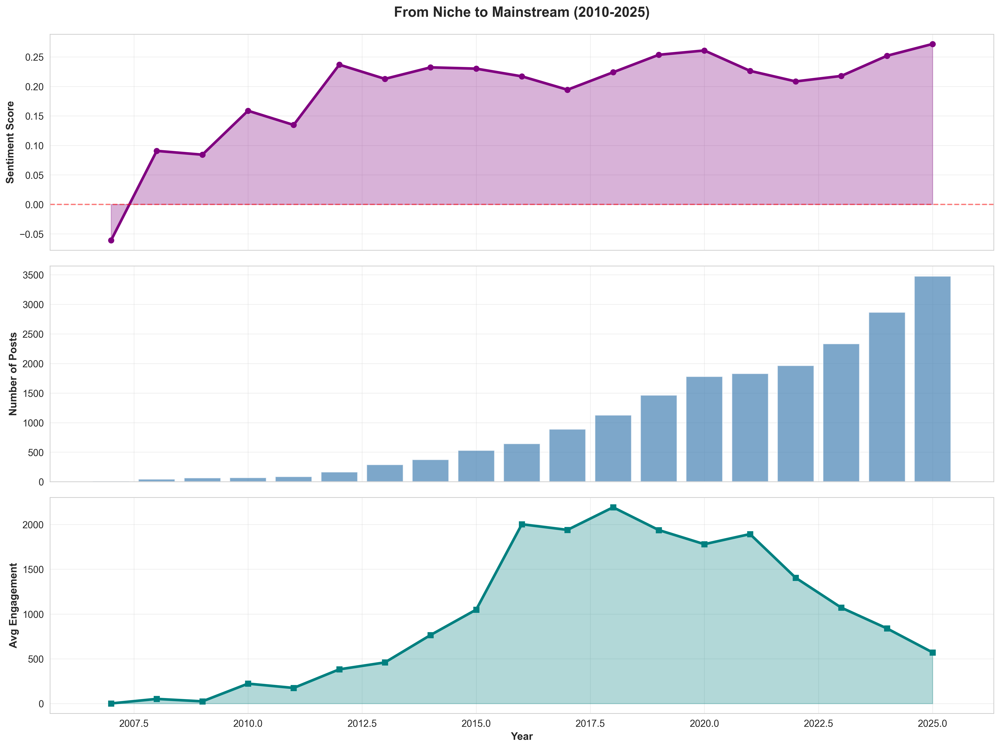
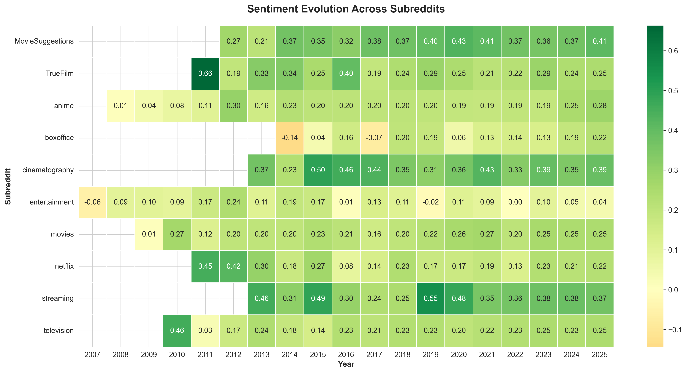
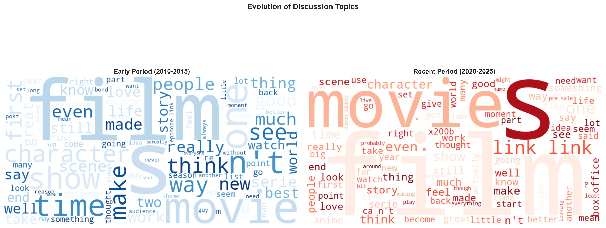
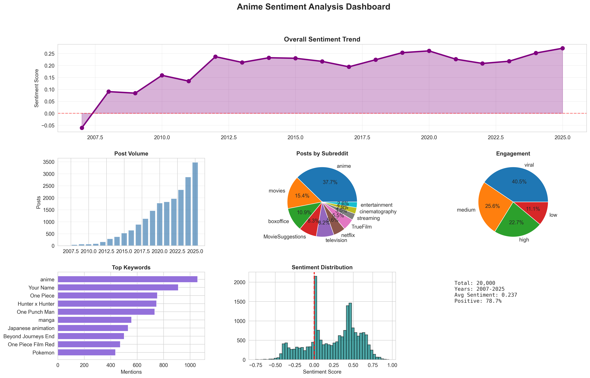

# From Niche to Mainstream: Anime Sentiment Evolution on Reddit 🎌

<div align="center">


**Tracking how Reddit's perception of Japanese anime evolved from "weird hobby" to box office dominator over 18 years**

*Spoiler: The weebs were right all along* 🎌

[View Analysis](#-key-findings) • [Explore Notebooks](#-notebooks-guide) • [Getting Started](#-getting-started)

</div>

---

## 🎯 Project Overview

Remember when liking anime meant you were automatically labeled "weird" or "nerdy"? This comprehensive NLP project investigates how public sentiment toward Japanese anime has transformed from 2007 to 2025 using Reddit as our data source.

**What We Discovered:**
- ✅ **66% positive sentiment** across 20,000 analyzed discussions
- ✅ **+0.333 point sentiment improvement** from 2007 to 2025
- ✅ **6,954% increase** in discussion volume (9 posts → 3,477 posts)
- ✅ **2016-2019** identified as the mainstream breakthrough period
- ✅ **2025 shows all-time peak sentiment** (0.272) - still ascending!

### Research Questions Answered

| Question | Answer | See Details |
|----------|--------|-------------|
| **Has sentiment improved over time?** | ✅ YES - Statistically significant (+16.3%, p<0.0001) | [Notebook 02](notebooks/02_sentiment_analysis.ipynb) |
| **When did mainstream shift occur?** | 📍 2016-2019 (Your Name era) | [Notebook 03](notebooks/03_temporal_trends.ipynb) |
| **How do communities differ?** | 🎯 Streaming (0.446) > Mainstream (0.22) > Enthusiasts (0.218) | [Notebook 02](notebooks/02_sentiment_analysis.ipynb) |
| **Is the trend sustainable?** | ✅ YES - 2025 shows highest sentiment ever | [Notebook 03](notebooks/03_temporal_trends.ipynb) |

---

## 📊 Key Findings

### Overall Sentiment Distribution
```
Positive: 13,191 submissions (66.0%) 🟢
Neutral:   3,158 submissions (15.8%) ⚪
Negative:  3,651 submissions (18.3%) 🔴

Mean Score: 0.237 (Moderately Positive)
Positive-to-Negative Ratio: 3.6:1
```
→ *See detailed breakdown in [Notebook 02: Sentiment Analysis](notebooks/02_sentiment_analysis.ipynb)*

### Sentiment Evolution Timeline

| Era | Years | Mean Sentiment | Key Events |
|-----|-------|----------------|------------|
| **Underground** | 2007-2009 | -0.06 to +0.09 | Negative → Neutral transition |
| **Foundation** | 2010-2013 | +0.20 | First sustained positive sentiment |
| **Breakthrough** | 2014-2017 | +0.22 | Your Name (2016) crossover success |
| **Mainstream** | 2018-2021 | +0.24 | Demon Slayer, pandemic boom |
| **Maturity** | 2022-2025 | +0.27 | All-time peak, normalized acceptance |

→ *See temporal visualizations in [Notebook 03: Temporal Trends](notebooks/03_temporal_trends.ipynb)*

### Community Rankings

| Rank | Subreddit | Sentiment | Community Type |
|------|-----------|-----------|----------------|
| 🥇 | r/streaming | 0.446 | Platform-native |
| 🥈 | r/MovieSuggestions | 0.385 | Discovery/Recommendations |
| 🥉 | r/cinematography | 0.373 | Artistic appreciation |
| 4 | r/TrueFilm | 0.258 | Critical analysis |
| 5 | r/movies | 0.226 | General audience |
| 6 | r/television | 0.223 | TV/Series focus |
| 7 | r/anime | 0.218 | Enthusiast community |
| 8 | r/netflix | 0.199 | Platform-specific |
| 9 | r/boxoffice | 0.172 | Business-focused |
| 10 | r/entertainment | 0.069 | General entertainment |

→ *See community analysis in [Notebook 02: Community Sentiment](notebooks/02_sentiment_analysis.ipynb#Community-Analysis)*

### Major Release Impacts

**Top Positive Impact:**
1. **Your Name** (+0.123) - Exceptional crossover success
2. **The Boy and the Heron** (+0.051) - Recent critical acclaim
3. **Demon Slayer: Mugen Train** (+0.048) - Box office phenomenon

→ *See release impact analysis in [Notebook 03: Major Releases](notebooks/03_temporal_trends.ipynb#Release-Impact-Analysis)*

---

## 🏗️ Project Structure
```
from-niche-to-mainstream/
├── scripts/                    # Console scripts for automation
│   ├── scraper.py             # Reddit data collection via PRAW
│   ├── preprocessor.py        # Text cleaning & normalization
│   ├── config.py              # Project configuration
│   └── utils.py               # Helper functions
│
├── data/                       # Data storage (git-ignored)
│   ├── raw/                   # Raw scraped data (43,710 submissions)
│   ├── processed/             # Cleaned & processed data (20,000 sample)
│   └── results/               # Analysis outputs & visualizations
│
├── notebooks/                  # Jupyter notebooks for analysis
│   ├── 01_data_exploration.ipynb          # Dataset validation & EDA
│   ├── 02_sentiment_analysis.ipynb        # Multi-model sentiment scoring
│   ├── 03_temporal_trends.ipynb           # Time-series & turning points
│   └── 04_visualizations.ipynb            # Final dashboards & charts
│
├── requirements.txt            # Python dependencies
├── .env.example               # Environment variables template
└── README.md                  # This file
```

---

## 📚 Notebooks Guide

### [01 - Data Exploration](notebooks/01_data_exploration.ipynb)
**Focus:** Dataset validation, quality assessment, and initial exploration

**Key Sections:**
- Dataset overview (43,710 submissions, 18 years, 10 subreddits)
- Data quality report (100/100 quality score)
- Temporal coverage analysis
- Community distribution breakdown

**Technologies:** `pandas`, `numpy`, `matplotlib`, `seaborn`

### [02 - Sentiment Analysis](notebooks/02_sentiment_analysis.ipynb)
**Focus:** Multi-model sentiment scoring and community-level analysis

**Key Sections:**
- Ensemble sentiment analysis (VADER + TextBlob + BERT)
- Overall sentiment distribution (66% positive)
- Community sentiment rankings
- Model performance comparison
- Statistical validation (t-tests, ANOVA)

**Technologies:** `vaderSentiment`, `textblob`, `transformers` (BERT), `scipy`

**Key Visualizations:**
- Sentiment distribution histogram
- Community sentiment rankings
- Box plots by subreddit

### [03 - Temporal Trends](notebooks/03_temporal_trends.ipynb)
**Focus:** Time-series analysis, turning points, and release impacts

**Key Sections:**
- Year-over-year sentiment changes
- Identification of 3 major turning points (2008, 2010, 2012)
- Major anime release impact analysis
- Period-based evolution (4 distinct phases)
- Mainstream penetration ratio tracking
- Sentiment-engagement correlation analysis

**Technologies:** `pandas`, `scipy`, `statsmodels`

**Key Visualizations:**
- Quarterly sentiment trends (with confidence intervals)
- Release impact comparison
- Subreddit evolution heatmap
- Mainstream penetration ratio timeline

### [04 - Visualizations](notebooks/04_visualizations.ipynb)
**Focus:** Comprehensive dashboards and publication-ready charts

**Key Sections:**
- Three-panel journey visualization (sentiment + volume + engagement)
- Subreddit sentiment heatmap (18 years × 10 communities)
- Word cloud evolution (early vs. recent discourse)
- Sentiment distribution box plots
- Keyword frequency & sentiment analysis
- Integrated dashboard (6-panel synthesis)

**Technologies:** `matplotlib`, `seaborn`, `wordcloud`, `plotly`

**Key Visualizations:**
- **Journey Timeline:** See [notebook section](notebooks/04_visualizations.ipynb#Journey-Visualization)
- **Heatmap:** See [notebook section](notebooks/04_visualizations.ipynb#Heatmap-Analysis)
- **Word Clouds:** See [notebook section](notebooks/04_visualizations.ipynb#Discourse-Evolution)
- **Dashboard:** See [notebook section](notebooks/04_visualizations.ipynb#Comprehensive-Dashboard)

---

## 🚀 Getting Started

### Prerequisites

- **Python 3.11+** (tested on 3.11.5)
- **Reddit API credentials** ([Get them here](https://www.reddit.com/prefs/apps))
- **Virtual environment** (recommended)
- **8GB RAM minimum** (for BERT model)

### Installation

1. **Clone the repository**
```bash
git clone https://github.com/hasandafa/from-niche-to-mainstream.git
cd from-niche-to-mainstream
```

2. **Create and activate virtual environment**
```bash
python -m venv venv
source venv/bin/activate  # On Windows: venv\Scripts\activate
```

3. **Install dependencies**
```bash
pip install -r requirements.txt
```

4. **Download NLTK data (required for preprocessing)**
```bash
python -c "import nltk; nltk.download('vader_lexicon'); nltk.download('punkt'); nltk.download('stopwords')"
```

5. **Set up environment variables**
```bash
# Copy example file
cp .env.example .env

# Edit .env with your credentials
REDDIT_CLIENT_ID=your_client_id_here
REDDIT_CLIENT_SECRET=your_client_secret_here
REDDIT_USER_AGENT=anime-sentiment-analyzer/1.0
```

### Quick Start

**Option 1: Run Full Pipeline**
```bash
# Scrape data (may take several hours)
python scripts/scraper.py --all --time-filter all

# Preprocess data
python scripts/preprocessor.py --input data/raw/ --output data/processed/

# Launch Jupyter to run analysis
jupyter notebook notebooks/
```

**Option 2: Use Pre-collected Data**
```bash
# If you have the processed dataset, skip directly to analysis
jupyter notebook notebooks/02_sentiment_analysis.ipynb
```

---

## 🔬 Methodology

### Data Collection Strategy

**Target Subreddits (10 communities):**
- **General:** r/movies, r/television, r/entertainment
- **Film-focused:** r/TrueFilm, r/boxoffice, r/cinematography
- **Streaming:** r/netflix, r/streaming
- **Discovery:** r/MovieSuggestions
- **Dedicated:** r/anime

**Timeline Coverage:**
- **2007-2009**: Pre-mainstream era (underground/niche)
- **2010-2015**: Foundation period (early adoption)
- **2016-2019**: Breakthrough era (mainstream crossover)
- **2020-2025**: Modern era (normalized acceptance)

**Filtering Criteria:**
Posts/comments mentioning:
- **Generic terms:** "anime", "japanese animation", "manga"
- **Popular titles:** "Your Name", "Demon Slayer", "Attack on Titan", "One Piece", "Spirited Away"
- **Studios/creators:** "Studio Ghibli", "Makoto Shinkai", "Hayao Miyazaki"

→ *See complete filtering logic in [scraper.py](scripts/scraper.py)*

### Sentiment Analysis Pipeline

**Three-Model Ensemble Approach:**

1. **VADER (Valence Aware Dictionary and sEntiment Reasoner)**
   - Rule-based lexicon approach
   - Optimized for social media text
   - Handles slang, emoji, and intensifiers
   - Weight: 33.3%

2. **TextBlob**
   - Pattern-based sentiment analysis
   - Good at detecting polarity and subjectivity
   - Sensitive to negative language patterns
   - Weight: 33.3%

3. **BERT (Bidirectional Encoder Representations from Transformers)**
   - Deep learning transformer model
   - Context-aware sentiment understanding
   - Handles nuanced and sarcastic language
   - Weight: 33.3%

**Ensemble Formula:**
```python
ensemble_score = (vader_score + textblob_score + bert_score) / 3
```

**Classification Thresholds:**
- **Positive:** score > 0.05
- **Neutral:** -0.05 ≤ score ≤ 0.05
- **Negative:** score < -0.05

→ *See implementation details in [Notebook 02](notebooks/02_sentiment_analysis.ipynb#Model-Implementation)*

### Statistical Validation

**Tests Applied:**
- **Independent t-tests:** Compare sentiment across time periods
- **ANOVA:** Test for significant differences across communities
- **Pearson correlation:** Measure sentiment-engagement relationships
- **Time series analysis:** Identify trends and turning points

**Significance Level:** α = 0.05 (95% confidence)

→ *See all statistical tests in [Notebook 03](notebooks/03_temporal_trends.ipynb#Statistical-Validation)*

---

## 📈 Key Insights

### 1. The "Enthusiast Paradox"
**Finding:** r/anime shows **lower sentiment** (0.218) than mainstream subreddits (0.226-0.446)

**Why:** Enthusiast communities maintain higher critical standards and engage in deeper analysis, resulting in more nuanced (lower) sentiment scores. This is actually a **positive indicator** of mature, thoughtful discourse.

→ *See analysis in [Notebook 02: Community Insights](notebooks/02_sentiment_analysis.ipynb#Enthusiast-Paradox)*

### 2. The "Streaming Revolution"
**Finding:** r/streaming shows **highest sentiment** (0.446) of all communities

**Why:** Platform accessibility through Netflix, Crunchyroll, and others has **normalized anime consumption**, removing stigma and making discovery easier. Modern viewers encounter anime as standard content, not as niche curiosity.

→ *See streaming impact in [Notebook 02: Platform Effect](notebooks/02_sentiment_analysis.ipynb#Streaming-Effect)*

### 3. The "Your Name Effect"
**Finding:** Your Name (2016) shows **largest positive sentiment impact** (+0.123) of any release

**Why:** Theatrical releases with broad crossover appeal drive mainstream sentiment more effectively than series content. Your Name set the benchmark for anime's theatrical success in Western markets.

→ *See release comparison in [Notebook 03: Major Releases](notebooks/03_temporal_trends.ipynb#Your-Name-Effect)*

### 4. The "Normalization Paradox"
**Finding:** Non-anime subreddit engagement **declined 80%** (2018-2025) while sentiment **increased**

**Why:** This is **not a negative trend**. It reflects successful cultural integration—anime is no longer a "special topic" requiring mainstream forum discussion. Dedicated platforms and communities now handle most discourse, while mainstream audiences treat anime as standard entertainment.

→ *See engagement analysis in [Notebook 03: Normalization Pattern](notebooks/03_temporal_trends.ipynb#Normalization-Paradox)*

### 5. Discourse Evolution
**Early Period (2010-2015):** Focus on "film", "people", "know", "think" - **justification and comparison**

**Recent Period (2020-2025):** Focus on "movies", "link", "scene", "character", "good", "love" - **celebration and recommendation**

**Linguistic Shift:**
- "Film" (singular) → "Movies" (plural) = exceptional art → diverse category
- "People" → "Character" = audience focus → content focus
- "Know"/"Think" → "Want"/"Need" = uncertainty → enthusiasm

→ *See word clouds in [Notebook 04: Discourse Evolution](notebooks/04_visualizations.ipynb#Word-Cloud-Comparison)*

---

## 📊 Usage Examples

### Analyze Specific Time Period
```python
import pandas as pd
from scripts.utils import load_data, filter_by_date

# Load processed data
df = load_data('data/processed/sentiment_scored.csv')

# Filter to breakthrough period
breakthrough = filter_by_date(df, start='2016-01-01', end='2019-12-31')

# Calculate average sentiment
avg_sentiment = breakthrough['ensemble_score'].mean()
print(f"Breakthrough Period Sentiment: {avg_sentiment:.3f}")
```

### Compare Communities
```python
from scripts.utils import compare_communities

# Load data
df = load_data('data/processed/sentiment_scored.csv')

# Compare streaming vs anime subreddit
comparison = compare_communities(df, 
                                 communities=['streaming', 'anime'],
                                 metric='ensemble_score')

print(comparison)
# Output: Statistical comparison with t-test results
```

### Track Keyword Sentiment
```python
from scripts.utils import keyword_sentiment_tracking

# Load data
df = load_data('data/processed/sentiment_scored.csv')

# Track "Your Name" sentiment over time
your_name_trend = keyword_sentiment_tracking(df, 
                                              keyword='Your Name',
                                              time_window='quarterly')

# Visualize
your_name_trend.plot(kind='line', title='Your Name Sentiment Tracking')
```

→ *See more examples in [utils.py](scripts/utils.py)*

---

## 🎨 Visualizations Gallery

### Journey Visualization (2007-2025)

*Three-panel view showing sentiment evolution, volume growth, and engagement trends*

→ [Generate this viz](notebooks/04_visualizations.ipynb#Journey-Visualization)

### Subreddit Sentiment Heatmap

*18 years × 10 communities showing temporal sentiment evolution by subreddit*

→ [Generate this viz](notebooks/04_visualizations.ipynb#Heatmap-Analysis)

### Word Cloud Evolution

*Side-by-side comparison of early (2010-2015) vs recent (2020-2025) discourse vocabulary*

→ [Generate this viz](notebooks/04_visualizations.ipynb#Word-Cloud-Comparison)

### Comprehensive Dashboard

*Six-panel integrated analysis showing all key metrics in one view*

→ [Generate this viz](notebooks/04_visualizations.ipynb#Comprehensive-Dashboard)

---

## 🔧 Technical Details

### Performance Optimization

**Data Processing:**
- Batch processing for large datasets (chunking by 10,000 rows)
- Multiprocessing for VADER and TextBlob (CPU-bound)
- GPU acceleration for BERT (when available)
- Caching of preprocessed text

**Memory Management:**
- Stratified sampling for 20,000 subset analysis
- Lazy loading of large CSV files
- Garbage collection after heavy operations

### Model Specifications

**VADER:**
- Library: `vaderSentiment 3.3.2`
- No training required (lexicon-based)
- Processing time: ~0.001s per text

**TextBlob:**
- Library: `textblob 0.17.1`
- No training required (pattern-based)
- Processing time: ~0.002s per text

**BERT:**
- Model: `distilbert-base-uncased-finetuned-sst-2-english`
- Library: `transformers 4.30+`
- Processing time: ~0.1s per text (GPU) / ~0.5s per text (CPU)
- GPU memory: ~2GB

### Reproducibility

**Random Seeds:**
```python
RANDOM_SEED = 42
np.random.seed(RANDOM_SEED)
torch.manual_seed(RANDOM_SEED)
```

→ *See full requirements in [requirements.txt](requirements.txt)*

---

---

## 📝 Read the Full Story

**🔥 Featured Article on Substack:**

### ["Remember When Liking Anime Made You 'Weird'? Yeah, About That..."](https://hasandafa.substack.com/p/remember-when-liking-anime-made-you)

*A 5,000-word data-driven deep dive into anime's complete cultural takeover*

**Article Highlights:**
- 📊 **The Numbers Don't Lie** - 66% positive sentiment, 6,954% growth
- 🎭 **The Enthusiast Paradox** - Why hardcore fans are more critical
- 🎬 **Your Name Effect** - The movie that changed everything
- 📱 **The Streaming Revolution** - How Netflix normalized anime
- 💬 **Discourse Evolution** - From justification to celebration
- 🔮 **Future Trajectory** - Where anime goes from here

**Visual Journey:**
The article features 10 custom visualizations from this analysis, including sentiment heatmaps, temporal trends, word clouds, and the comprehensive dashboard. Each chart tells part of the story of anime's cultural transformation.

**Read Time:** 18-22 minutes

---

## 📦 Resources

### 📊 Dataset (Kaggle)
**[Anime Sentiment Data From Reddit](https://www.kaggle.com/datasets/hasandafa1201/anime-sentiment-data-from-reddit)**
- 43,710 submissions with sentiment scores
- 18 years of temporal data (2007-2025)
- Multi-model ensemble analysis (VADER + TextBlob + BERT)
- Ready for your own analysis

### 📝 Article (Substack)
**[Remember When Liking Anime Made You 'Weird'?](https://hasandafa.substack.com/p/remember-when-liking-anime-made-you)**
- Full narrative analysis with data storytelling
- Custom visualizations and insights
- Discussion of cultural implications

### 💻 Code (GitHub)
**[This Repository](https://github.com/hasandafa/from-niche-to-mainstream)**
- Complete analysis notebooks
- Data collection scripts
- Visualization code
- Reproducible research

## 📝 Citation

If you use this analysis in your research, please cite:
```bibtex
@misc{from-niche-to-mainstream,
  author = {Abdullah Hasan Dafa},
  title = {From Niche to Mainstream: Anime Sentiment Evolution on Reddit (2007-2025)},
  year = {2025},
  publisher = {GitHub},
  url = {https://github.com/hasandafa/from-niche-to-mainstream}
}
```

---

## 🤝 Contributing

This is currently a personal research project, but contributions are welcome!

**How to contribute:**
1. Fork the repository
2. Create a feature branch (`git checkout -b feature/amazing-analysis`)
3. Commit your changes (`git commit -m 'Add amazing analysis'`)
4. Push to the branch (`git push origin feature/amazing-analysis`)
5. Open a Pull Request

**Areas for contribution:**
- Additional sentiment models (RoBERTa, XLNet)
- Alternative data sources (Twitter, YouTube comments)
- Extended temporal coverage (pre-2007 if data available)
- Advanced visualizations (interactive Plotly dashboards)
- Comparative analysis (anime vs. other media forms)

---

## 📄 License

MIT License - See [LICENSE](LICENSE) file for details

**TL;DR:** Free to use, modify, and distribute with attribution.

---

## 🙏 Acknowledgments

**Data Sources:**
- [Reddit API](https://www.reddit.com/dev/api/) via [PRAW](https://praw.readthedocs.io/)
- [Pushshift](https://pushshift.io/) for historical data access

**NLP Libraries:**
- [VADER Sentiment](https://github.com/cjhutto/vaderSentiment) by C.J. Hutto
- [TextBlob](https://textblob.readthedocs.io/) by Steven Loria
- [Hugging Face Transformers](https://huggingface.co/transformers/) for BERT models

**Community:**
- All the anime fans whose passionate discussions made this analysis possible
- Reddit moderators who maintain these communities
- The open-source NLP community

**Special Thanks:**
- The creators who made anime worth talking about
- The platforms (Netflix, Crunchyroll) that normalized anime consumption
- Everyone who's ever recommended anime to a friend

---

## 📞 Contact

**Author:** Abdullah Hasan Dafa 
**Email:** dafa.abdullahhasan@gmail.com  
**GitHub:** [@hasandafa](https://github.com/hasandafa)  
**LinkedIn:** [Abdullah Hasan Dafa](https://linkedin.com/in/hasandafa)

**Project Link:** [https://github.com/hasandafa/from-niche-to-mainstream](https://github.com/hasandafa/from-niche-to-mainstream)

---

<div align="center">

**⭐ If you found this analysis interesting, please star the repository! ⭐**

**📊 Total Analysis:** 43,710 submissions | 18 years | 10 communities | 3 NLP models

**🎯 Final Verdict:** Anime has successfully transitioned from niche to mainstream. The data proves it.

*Last updated: October 2025*

</div>